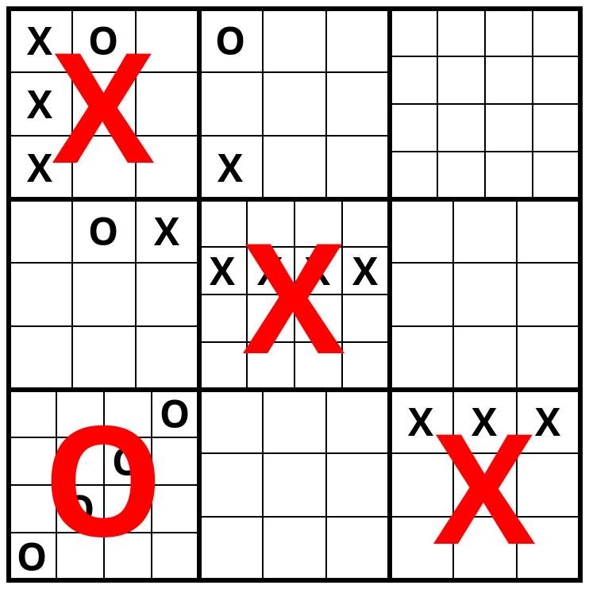

# OOXXwars

An advanced TicTacToe game based on Haskell and the Brick library.

## Who we are

| Name         |        |           |
| ------------ | ------ | --------- |
| Zhiyuan Qi   | zhqi   | A59002572 |
| Ruochen Wang | ruw028 | A59011298 |
| York Liu     | yil173 | A14689456 |
| Haofeng Xie  | haxie  | A59002570 |

## What it is

This game is an advanced version of Tic-Tac-Toe. Note that, in a traditional Tic-Tac-Toe game, two players take turns to mark the spaces in a three-by-three grid with X or O. The player who succeeds in placing three of their marks in a horizontal, vertical, or diagonal row is the winner. 

Our game is a **nested** Tic-Tac-Toe game, which is composed of `3 x 3` traditional Tic-Tac-Toe games as its sub-games. Specifically, it is composed of a `3 x 3` big grid, and each grid in our game is a traditional Tic-Tac-Toe game. 

In our game, two players take turns to mark space in any grid in any sub-game with `X` or `O`, just like in traditional games. When a sub-game in one particular big grid is finished, the whole big grid will be marked with the mark used by the sub-game winner. And the mark of a big grid is determined by the win/loss result of the corresponding sub-Tic-Tac-Toe game. The player who succeeds in winning three sub-games horizontally, vertically, or diagonally is the winner.

## How to implement it

### Model

We’re going to structure the codebase based on the MVC framework. First of all, the essential data model of this game is a 3-d array [[[ Entry ]]] called boards, where 

- Entry = O | X | Empty
- Boards[i] is a 2D square board for the i-th subgame. 

### View

One section of the code is going to read this 3-d array and turn it into a TUI using the Brick Library. 

If time permits, we will also implement fancy ASCII art animations using Brick, such as when an entry is marked, when a subgame is finished, and when the game finishes.

### Controller

Another section of the code handles user input (keyboard), modification to the data model, and the winning logic. 

If time permits, we would also like to explore the option of mouse input.

## Extra

If everything above proceeds smoothly ahead of time, there are several other things we wish to try

- AI opponent (minimax, limit depth)

## Plan of execution

Two of us are going to handle the view component, and the other two will write the controller component. Below is a time line.

- Setup the basic data model and project folder structure by Sunday 11/14.
- Complete View and Controller by Sunday 11/21
- Present the updates by Sunday 11/25
- Write optional components by Sunday 12/5
- Deliver on Friday 12/10
